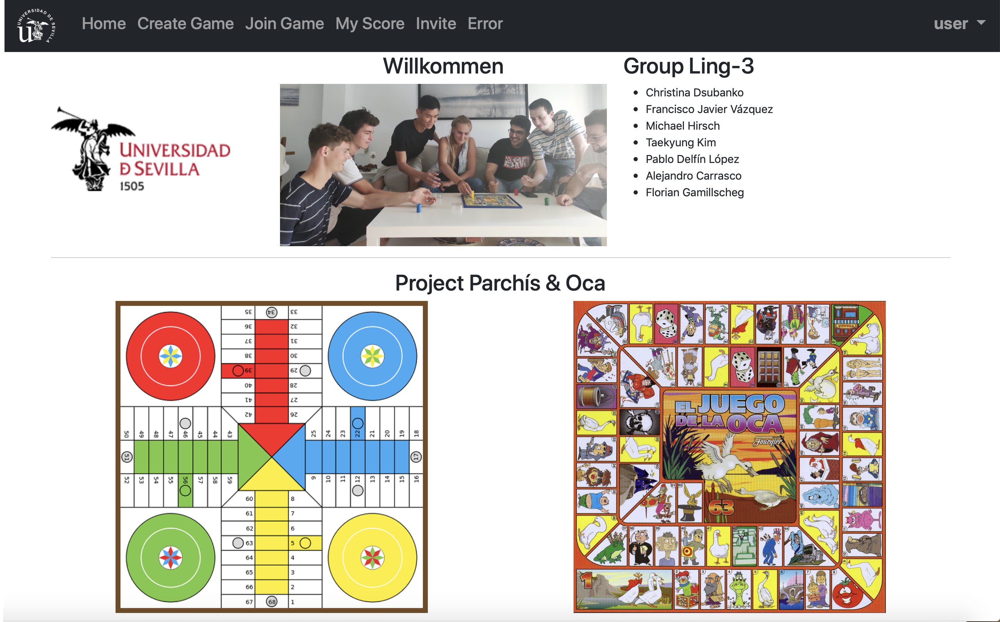

# Parchís and Oca  Application

This is a project of Group LIng-3:

* Alejandro Carrasco Nuñez
* Pablo Delfin Lopez Benitez
* Christina Dsubanko
* Florian Gamillscheg
* Michael Hirsch
* Francisco Javier Vazquez Monge
* Kim Taekyung

This is originally a fork of https://github.com/spring-projects/spring-petclinic that is used for the DP1 course. For this 
course, we implemented [Parchís](https://en.wikipedia.org/wiki/Parch%C3%ADs) and [Oca](https://en.wikipedia.org/wiki/Game_of_the_Goose), two traditional board games, that can be played by up to 4 players. A description of Parchís and Oca can be found
also as a [video](https://youtu.be/UGfm4RM0_tM).

## Running Parchís and Oca locally
Our Parchís and Oca application is based on [Spring Boot](https://spring.io/guides/gs/spring-boot), using [Maven](https://spring.io/guides/gs/maven/). You can build a jar file and run it from the command line:


```
git clone git@github.com:gii-is-DP1/dp1-2021-2022-ling-3.git
cd dp1-2021-2022-ling-3
./mvnw package
java -jar target/*.jar
```

You can then access Parcís and Oca here: http://localhost:8080/


Or you can run it from Maven directly using the Spring Boot Maven plugin. If you do this it will pick up changes that you make in the project immediately (changes to Java source files require a compile as well - most people use an IDE for this):

```
./mvnw spring-boot:run
```

## Database configuration

In its default configuration, Parchiís and Oca use an in-memory database (H2) which
gets populated at startup with data.

### Prerequisites
The following items should be installed in your system:
* Java 11 or newer.
* git command line tool (https://help.github.com/articles/set-up-git)
* Your preferred IDE
    * Eclipse with the m2e plugin. Note: when m2e is available, there is an m2 icon in `Help -> About` dialog. If m2e is
      not there, just follow the install process here: https://www.eclipse.org/m2e/
    * [Spring Tools Suite](https://spring.io/tools) (STS)
    * IntelliJ IDEA
    * [VS Code](https://code.visualstudio.com)

### Steps:

1) On the command line
```
git clone git@github.com:gii-is-DP1/dp1-2021-2022-ling-3.git
```
2) Inside Eclipse or STS
```
File -> Import -> Maven -> Existing Maven project
```

Then either build on the command line `./mvnw generate-resources` or using the Eclipse launcher (right click on project and `Run As -> Maven install`) to generate the css. Run the application main method by right clicking on it and choosing `Run As -> Java Application`.

3) Inside IntelliJ IDEA

In the main menu, choose `File -> Open` and select the Parchís and Oca [pom.xml](pom.xml). Click on the `Open` button.

CSS files are generated from the Maven build. You can either build them on the command line `./mvnw generate-resources`
or right click on the `parchisoca` project then `Maven -> Generates sources and Update Folders`.

A run configuration named `ParchisocaApplication` should have been created for you if you're using a recent Ultimate
version. Otherwise, run the application by right clicking on the `ParchisocaApplication` main class and choosing
`Run 'ParchisocaApplication'`.

4) Navigate to ParchisOca

Visit [http://localhost:8080](http://localhost:8080) in your browser.


